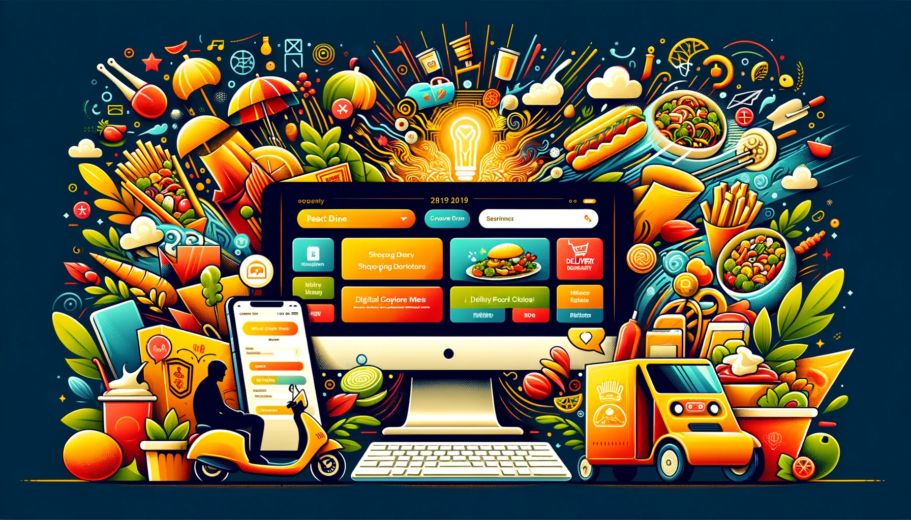

# Final Project

### Advanced Web Programming

## Project

ReactDine – Your Digital Gateway to React Diner’s Kitchen

## Project Description

ReactDine is a dedicated online ordering system for the React Diner, designed to provide a seamless and interactive way for customers to view the menu, create food orders, and enjoy a user-friendly checkout process. Built with React, this application will offer a rich, dynamic user experience with an emphasis on the unique branding and offerings of React Diner.
